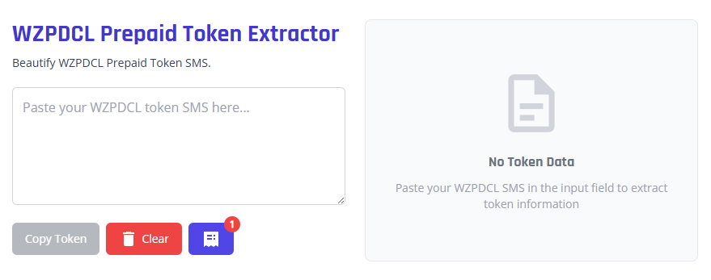

# WZPDCL Prepaid Token Extractor

A web application that extracts and formats prepaid token information from WZPDCL (West Zone Power Distribution Company Limited) SMS messages.



## Features

- Extract token information from WZPDCL SMS messages
- Display formatted token data including:
  - Prepaid token
  - Sequence number
  - Meter number
  - Vending amount
  - Energy cost
  - Total charge
  - Meter rent
  - Demand charge
  - VAT
  - Rebate
- Save tokens locally in your browser
- View and manage saved tokens
- Copy token information to clipboard
- Responsive design for mobile and desktop

## How to Use

1. Paste your WZPDCL SMS message in the input field
2. The application will automatically extract and display the token information
3. Click "Copy All" to copy the formatted token information to your clipboard
4. Click the receipt icon to view your saved tokens
5. Click "Clear" to clear the current input and results

## Development

This project is built with:

- [Astro](https://astro.build/) - The web framework
- [Tailwind CSS](https://tailwindcss.com/) - For styling
- [Iconify](https://iconify.design/) - For icons via unplugin-icons

### Prerequisites

- Node.js (v18 or later)
- npm or yarn

### Installation

```bash
# Clone the repository
git clone https://github.com/anupdebnath/wzpdcl-prepaid-token-extractor.git

# Navigate to the project directory
cd wzpdcl-prepaid-token-extractor

# Install dependencies
npm install
```

### Development Server

```bash
# Start the development server
npm run dev
```

The application will be available at http://localhost:4321

### Build

```bash
# Build for production
npm run build

# Preview the production build
npm run preview
```